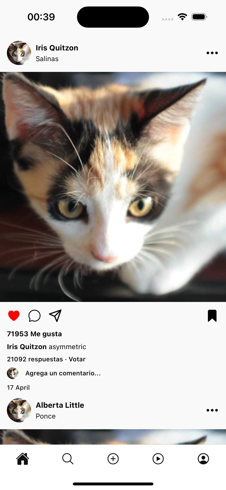

# Instagram Clone App

A brief description of your project.

<div align="center">
  
  
</div>

## Table of Contents

- [Introduction](#introduction)
- [Prerequisites](#prerequisites)
- [Installation](#installation)
- [Running the Project](#running-the-project)
- [Folder Structure](#folder-structure)
- [Contributing](#contributing)
- [License](#license)

## Introduction

This is a bare React Native project, set up without any external dependencies or third-party libraries. It serves as a starting point for developing mobile applications using React Native.

## Prerequisites

Before you begin, ensure you have met the following requirements:

- **Node.js** (version >= 18)
- **Yarn** (preferrable) or **npm**
- **Watchman** (for macOS users)
- **Xcode** (for iOS development)
- **Android Studio** (for Android development)

## Installation

To set up the project locally, follow these steps:

1. **Clone the repository:**

   ```bash
   git clone https://github.com/lucas-figueiredo-m/rn-simple-ig-clone
   cd rn-simple-ig-clone
   ```

2. **Install Dependencies**

Using Yarn

```bash
# Using yarn
yarn install

# Using npm
npm install
```

3. **Install Pods**

Run the pods script using yarn

```bash
# Using yarn
yarn pods

# Using npm
npm run pods
```

## Running the Project

First, start the development server on a terminal

```bash
# Using Yarn
yarn start

# Using npm
npm start
```

Then, on another terminal, run the platform-specific start command

```bash
   # iOS
   yarn run ios
   # or
   npm run ios

   # Android
   yarn run android
   # or
   npm run android
```

## Folder Structure

```plaintext
.
├── .husky/             # git hooks for automations
├── android/            # Android-specific files
├── ios/                # iOS-specific files
├── src/                # Your project's source code
│   ├── assets/         # Project local assets
│   ├── components/     # Reusable components
│   ├── navigators/     # Project navigator structure files
│   ├── screens/        # App screens
│   ├── services/       # Project's external services and peripheral code
│   └── themes/         # Set up of project's default spacing, font sizes color themes, etc
│   └── types/          # Project's resusable types and global type declarations
│   ├── App.tsx         # Entry point of the app
├── index.js            # Entry point for React Native
└── package.json        # Project configuration file

```

## Contributing

Check out the [contributing page of the project](https://github.com/lucas-figueiredo-m/rn-simple-ig-clone/blob/main/CONTRIBUTING.md)
